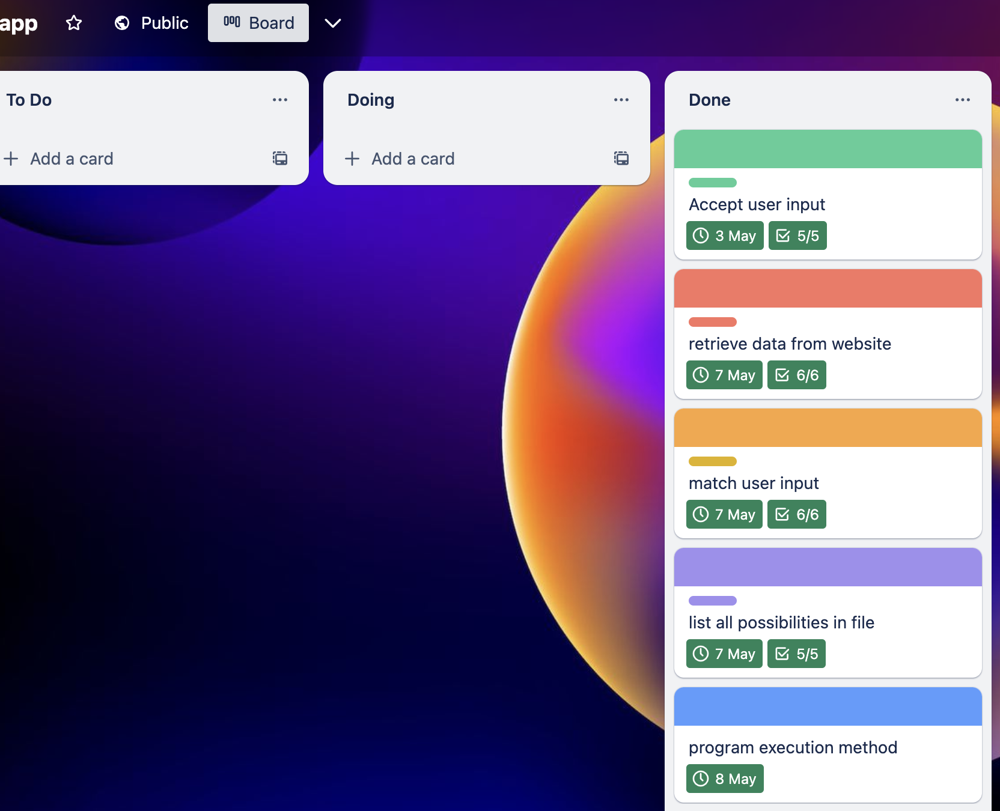

## Repo Link
[repo link](https://github.com/elle-n-lu/terminalApp_shopWithBudget)

## Demo Link
[demo link](https://youtu.be/Z7ErNIHKI1A)

## Python code style guide
The code style guide used in this project:

Indentation: Use 4 spaces per indentation level.

Line length: Limit all lines to a maximum of 79 characters.

Naming conventions: Use lowercase for variables and functions, and use underscores to separate words. For example, my_variable_name or my_function_name().

Comments: Use comments to explain your code when necessary, but avoid writing comments that simply restate the code.

Imports: Import modules at the beginning of the file, and use separate lines for each import statement.

Blank lines: Use blank lines to separate functions, classes, and other sections of code.

Refrence: van Rossum, G., Warsaw, B., & Coghlan, N. (2001). PEP 8 -- Style Guide for Python Code. Python Enhancement Proposals. Retrieved May 8, 2023, from https://peps.python.org/pep-0008/

## Features
1. Accept user input
user input budget and provide shoplist txt file which would be processed to a dict for the next step

2. According to user input, simulate the product list data retrieving online
<!-- use selenium to accumulate user browsing activity and beutifulsoup to extract searching data needed -->

3. Analyzing searching data and comparing with product keywords and budget, save results in file
* calculate total price of each possible combinations
* match keywords and budget in the shoplist provided in first step, get the final matched results and show results in terminal or saved in local csv file for user to check 

## Fearture implementation
1. implement 1st feature:

>checklist:
* find a format that user input should be
* decide what input information needed
* variables definition and receive way for the input
* input error handling
* file handling
* testing

2. implement 2st feature:

>checklist:
* find what packages needed to retrieve data from website
* find how to deal with retrieved data
* find what class and variables might need
* error handling
* data match user listing search
* testing

3. implement 3st feature:

>checklist:
* user budget should larger than or equal to total cost
* product name should include product name in user list
* product amount should be matched
* search item should match user input
* decide a format to save results, csv? txt?
* show total possibility numbers
* file save on Desktop to easy locate?
* error handling
* testing

[Trello Link](https://trello.com/b/7nLAXghH/app)

## App Instructions
make sure python3, google chrome installed.
* clone project then inside src folder
* open terminal
* make run.sh executable: chmod +x run.sh
* run ./run.sh
    * input a budget which should be a number
    * choose a path where a txt file 
    * simulating price and product data, so all products with keywords have a match and also have a price
    * if total cost of all possible combination all more than budget, then it will ask you enter y to continue to see resutls or enter nothing to quit.
    * will show results in terminal

